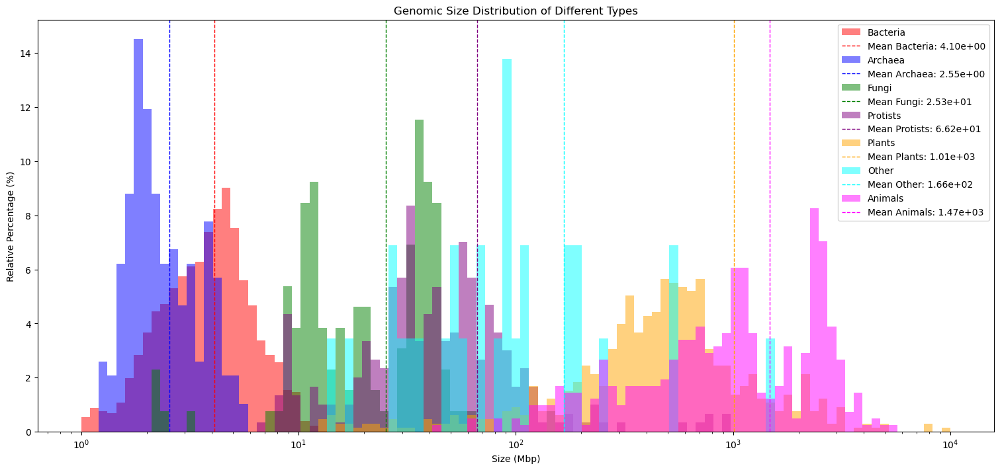
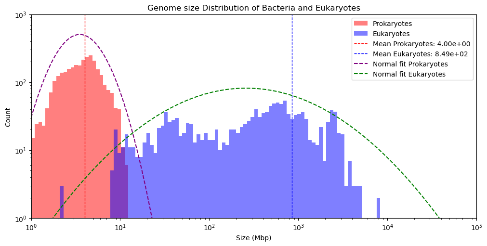
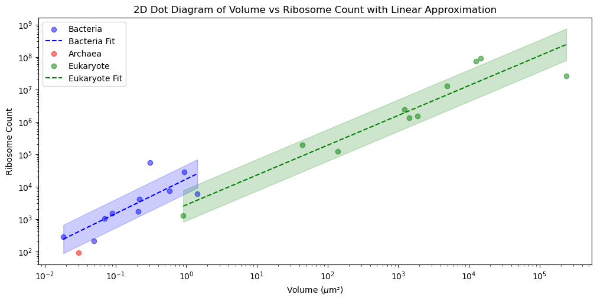

# Compartmentalization of Cells (Data visulization repository)

[](https://opensource.org/licenses/MIT)
[](https://jupyter.org/)
[](https://www.python.org/)

## Overview

This repository contains the data and code used for the analysis and visualization in the essay *Why is compartmentalization important for the proper functioning of eukaryotic cells?* by Eric Xin.

## Abstract

The compartmentalization of eukaryotic cells is essential for the proper functioning of the cell. The cell is divided into different compartments, each with its own unique environment. This allows the cell to carry out different functions in different parts of the cell. The compartments also increase the surface area to volume ratio of the cell, which is important for the exchange of materials between the cell and its environment. This report discusses the importance of compartmentalization for the proper functioning of eukaryotic cells, focusing on the role of chemical osmosis, reaction environments, and protein production.

## Data

The data used for analysis in this report are obtained from the following papers:
- Lynch, M. et al. (2017). Membranes and their role in cellular compartmentalization.
- Schavemaker, P. et al. (2022). The role of compartmentalization in cellular function.

## Structure

- `data/`: Contains the raw data files used for analysis.
- `plots.ipynb`: The Jupyter notebook used for data analysis and visualization.
- `results/img/`: Contains the sample figures

## Usage

1. Clone the repository:
    ```sh
    git clone https://github.com/ericxin/compartmentalization_of_cells.git
    ```
2. Navigate to the repository directory:
    ```sh
    cd compartmentalization_of_cells
    ```
3. Run the analysis scripts:
    ```sh
    jupyter plot.ipynb
    ```

## Dependencies

### Python

- matplotlib
- numpy
- pandas
- scipy

### Jupyter Notebook
- jupyter

### installation guide
```sh
pip install -r requirements.txt
```

## Sample Results
Some of the results are shown below:

### Figure 1: Distribution of Genome size in Archea, Bacteria, and different types of Eukaryotes



### Figure 2: Distribution of Genome size of Bacteria and Eukaryotes, fitted with normal distributions with log scale



### Figure 3: Dot plot of cell volumes vs surface areas for different types of cells, with linear approximation



## References

- Lynch, M. et al. (2017). Membranes and their role in cellular compartmentalization.
- Schavemaker, P. et al. (2022). The role of compartmentalization in cellular function.

## License
This repository is licensed under the [MIT License](LICENSE).

## Contact

For any questions or issues, please contact me at [me@ericxin.eu](mailto:me@ericxin.eu). If there is any issue with the data or code, please open an issue in this repository.